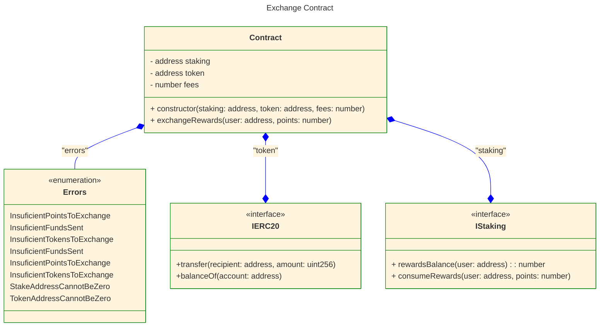

# Design Specifications

## Exchange Contract

### Class Diagram

```mermaid
---
title: Exchange Contract
---
%%{init: {'theme': 'base', 'themeVariables': { 'primaryBorderColor': 'green', 'background': 'yellow'}}}%%
classDiagram
    class Contract {
        - address staking
        - address token
        - number fees
       
        + constructor(staking: address, token: address, fees: number)
        + exchangeRewards(user: address, points: number) 
    }

    class Errors{
      <<enumeration>>
      InsuficientPointsToExchange
      InsuficientFundsSent
      InsuficientTokensToExchange
    }

    class IERC20 {
      <<interface>>
      +transfer(recipient: address, amount: uint256)
      +balanceOf(account: address)
    }

    class IStaking {
      <<interface>>
      + rewardsBalance(user: address) : number
      + consumeRewards(user: address, points: number)
    }

    class Errors{
      <<enumeration>>
      InsuficientFundsSent
      InsuficientPointsToExchange
      InsuficientTokensToExchange
      StakeAddressCannotBeZero
      TokenAddressCannotBeZero
    }
    
    Contract *-- Errors : "errors"
    Contract *--* IERC20 : "token"
    Contract *--* IStaking : "staking"
```
