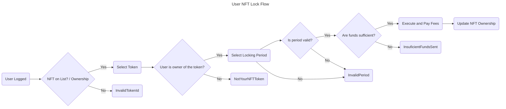

# 1. User NFT Lock Flow



## Contract

### Errors

The contract throws the following errors:

```solidity
// Custom error types
error InvalidFees(); // thrown when the fees are invalid (less than 0)
error InvalidRewardRate(); // thrown when the reward rate is invalid (less than 0)
error MissingNftAddress(); // thrown when the NFT contract address is not provided
error NFTAddressCannotBeZero(); // thrown when the NFT contract address is the zero address
error InvalidTokenId(); // thrown when the token ID does not exist
error NotYourNFTToken(); // thrown when the token does not belong to the user attempting an action
error InsuficientFundsSent(); // thrown when insufficient funds are sent for fees
error ClaimNotReady(); // thrown when (actual height - (stop height + period)) blocks is less than 0
error Unauthorized(); // thrown when has no enough access permissions
error InvalidPeriod(); // thrown when the staking period is not valid enumerate option
error AlreadyStaked(); // thrown when attempting to start staking for a token already staked
error NFTNotStaked(); // thrown when attempting to stop staking for a token not staked by the user
```

### Events

```solidity
// Define events
event LockNFTSuccess();
event UnlockNFTSuccess();
event RecoverNFTSuccess();
event ConsumeRewardsSuccess();
```

### Structs

```solidity
// Enum for periods
enum Period {
    ONE_DAY,
    SEVEN_DAYS,
    TWENTY_ONE_DAYS
}

// Struct for TokenData
struct TokenData {
    Period period; // Represents the period measured by height units that the NFT gets lock after unlocked where no Rewards are generated during this Period.
    uint256 start; // Starting height use on rewards calculation. Start when the owner stake and transfer ownership.
    uint256 end; // Ending height use on rewards calculation. Once unstake it, no more rewards will be counted.
}

// Struct for UserData
struct UserData {
    uint256 rewards; // Acumulated reward points, only updated when claim successful.
    mapping(uint256 => TokenData) tokens; // User token mapping data
}
```

### Variables

```solidity
// State Variables
address public nft; // Represents the ERC721 address
uint256 public rewardRate; // Represents how many rewards are produced by each height increase while staked
uint256 public fees; // Fees for startStaking(), stopStaking() and recover()
mapping(address => UserData) public users; // users staking and nft data
mapping(address => bool) public whitelist; // list of smart contracts that can interact with user points
```

### Functions

```solidity
/**
 * @dev Constructor function for the contract
 * @param _nftAddress Address of the NFT contract
 * @param _rewardRate Reward rate for staking
 * @param _feeAmount Fee amount for locking NFTs
 */
constructor(address _nftAddress, uint256 _rewardRate, uint256 _feeAmount) public {
  // - Store the owner.
  // - Check `rewardRate` =< 0
  //   - Throw `InvalidRewardRate`.
  // - Set `rewardRate`.
  // - Check `erc721` address == "".
  //   - Throw `MissingNftAddress`
  // - Check `erc721` address == 0.
  //   - Throw `NFTAddressCannotBeZero`
  // - Set `erc721` address.
  // - Check `rewardRate` < 0
  //   - Throw `InvalidFees`.
  // - Set `fees`.
}
```

```solidity
/**
 * @dev Locks an NFT for a specified period of time
 * @param tokenId The ID of the NFT to lock
 * @param period The period of time to lock the NFT for
 * @return bool Whether the NFT was successfully locked
 */
function lock(uint256 tokenId, uint256 period) public payable {
  // - Check if `tokenId` exist using `ERC721` `balanceOf(sender)` method.
  //   - Throw error `InvalidTokenId`
  // - Check `tokenId` ownership.
  //   - Throw error `NotYourNFTToken`
  // - Check `tokenId` has `user.get(tokenId).start > 0`.
  //   - Throw `AlreadyStaked`
  // - Check if `msg.value >= fees`
  //   - Throw error `InsuficientFundsSent`
  // - Check if correct `period` with valid enums periods.
  //   - Throw error `InvalidPeriod`
  // - Set as owner of `tokenId` using `IERC721` interface `safeTransferFrom(from, to, tokenId)`.
  // - Update `user.get(tokenId).start` and `user.get(tokenId).period`.
  // - Return event `LockNFTSuccess`
}
```

## User Scenarios

```gherkin
Feature: NFT Stake Lock Constructor
  As a contract deployer
  I want to ensure the constructor initializes the contract correctly
  So that the NFT stake lock functionality works as expected

  Scenario: Successful constructor initialization with valid parameters
    Given I provide a valid NFT address
    And I set a reward rate greater than 0
    And I set a fee amount greater than or equal to 0
    When I deploy the contract with these parameters
    Then the contract should be deployed successfully
    And the NFT address should be set correctly
    And the reward rate should be set correctly
    And the fee amount should be set correctly

  Scenario: Constructor error - Missing NFT address
    Given I do not provide an NFT address (i.e., empty string)
    When I attempt to deploy the contract
    Then an error "MissingNftAddress" should be thrown

  Scenario: Constructor error - NFT address is zero
    Given I provide an NFT address set to 0 (i.e., "0x000...000")
    When I attempt to deploy the contract
    Then an error "NFTAddressCannotBeZero" should be thrown

  Scenario: Constructor error - Invalid reward rate (less than or equal to 0)
    Given I set a reward rate less than or equal to 0
    When I attempt to deploy the contract
    Then an error "InvalidRewardRate" should be thrown

  Scenario Outline: Edge cases for reward rate and fee amount
    Given I set a reward rate to <reward_rate>
    And I set a fee amount to <fee_amount>
    When I attempt to deploy the contract
    Then the result should be <result>

    Examples:
      | reward_rate | fee_amount | result                                             |
      | 0           | 0          | Error "InvalidRewardRate" thrown                  |
      | 0           | 0          | Error "InvalidRewardRate" thrown                  |
      | 1           | 0          | Contract deployed successfully                     |
```

```gherkin
Feature: NFT Start Staking
  As a user
  I want to be able to lock my NFT for staking
  So that I can earn rewards

  Scenario: Lock NFT for staking
    Given I have an NFT
    And I am the owner of the NFT
    When I lock the NFT for staking with a valid period
    And I pay the required fees
    Then the NFT should be locked for staking
    And I should be able to view my NFT ownership

  Scenario: Lock NFT with invalid period
    Given I have an NFT
    And I am the owner of the NFT
    When I lock the NFT for staking with an invalid period
    Then an InvalidPeriod error should be thrown

  Scenario: Lock NFT that does not exist
    Given I do not have an NFT
    When I try to lock the NFT for staking
    Then an InvalidTokenId error should be thrown

  Scenario: Lock NFT that is already staked
    Given I have an NFT that is already staked
    When I try to lock the NFT for staking
    Then an AlreadyStaked error should be thrown

  Scenario: Lock NFT that I do not own
    Given I do not own the NFT
    When I try to lock the NFT for staking
    Then a NotYourNFTToken error should be thrown

  Scenario: Lock NFT with negative or zero period
    Given I have an NFT
    And I am the owner of the NFT
    When I lock the NFT for staking with a negative or zero period
    Then an InvalidPeriod error should be thrown

  Scenario: Lock NFT with insufficient fees
    Given I have an NFT
    And I am the owner of the NFT
    When I lock the NFT for staking with insufficient fees
    Then an InsuficientFundsSent error should be thrown
```

```gherkin
Feature: NFT Staking Points Calculation
  As a user
  I want the system to correctly calculate my staking points
  Based on the locked NFT's period
  So that I can accurately track my rewards

  Scenario Outline: Points calculation for valid lock periods
    Given I have an NFT locked for staking with a <period> period
    And the current block height is <current_height>
    And the NFT was locked at block height <lock_height>
    When I check my staking points
    Then my points should be calculated as <expected_points> based on the reward rate

    Examples:
      | period        | current_height | lock_height | expected_points |
      | ONE_DAY       | 100            | 90          | 10 * rewardRate |
      | SEVEN_DAYS    | 200            | 150         | 50 * rewardRate |
      | TWENTY_ONE_DAYS| 300            | 250         | 50 * rewardRate |

```

```gherkin
Feature: NFT Staking Points Calculation Error Handling
  As a user
  I want the system to handle points calculation errors correctly
  Based on the locked NFT's period and system constraints
  So that I can understand and resolve any issues

  Scenario: Points calculation for an invalid lock period
    Given I have an NFT locked with an invalid period (e.g., ZERO_DAYS)
    When I check my staking points
    Then an error "InvalidPeriodForPointsCalculation" should be displayed
```

### Acceptance Criteria

- The user can lock their NFT for staking with a valid period.
- The user can pay the required fees for locking their NFT for staking.
- The NFT is locked for staking and the user can view their NFT ownership.
- An error is displayed if the user tries to lock an NFT with an invalid period.
- An error is displayed if the user tries to lock an NFT without paying the required fees.
- An error is displayed if the user tries to lock an NFT that does not exist.
- An error is displayed if the user tries to lock an NFT that is already staked.
- An error is displayed if the user tries to lock an NFT that they do not own.
- An error is displayed if the user tries to lock an NFT with a negative or zero period.
- An error is displayed if the user tries to lock an NFT with insufficient fees.

### Test Data Requirements

- NFTs with different ownership statuses (e.g. owned by the user, not owned by the user, already staked)
- Different periods for locking NFTs (e.g. valid periods, invalid periods, negative or zero periods)
- Different fee amounts for locking NFTs (e.g. required fees, insufficient fees)
- NFT Lock Periods: Multiple NFTs locked with different valid periods (ONE_DAY, SEVEN_DAYS, TWENTY_ONE_DAYS)
- Block Height Variations: Scenarios with varying block heights to test points accumulation over time

### Definition of Done (DoD)

- The feature is fully implemented, and all scenarios have been tested.
- All acceptance criteria have been met.
- The feature has been reviewed and approved by the product owner.
- The feature has been tested and validated by the QA team.
- All bugs and issues have been resolved.
- The feature is fully documented, including user documentation and technical documentation.
- The feature has been deployed to production and is available for use by users.
