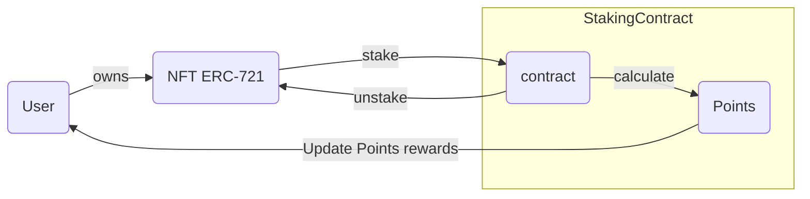
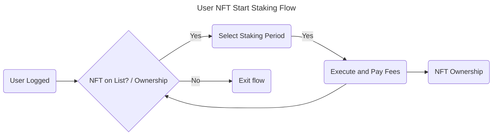

# 1. User NFT Start Staking Flow





## User Scenarios

```gherkin
# Scenario 1: Successful Start Staking
Scenario: Successful Start Staking
  Given the user is logged in
  And the user has an NFT on the list and is the owner
  When the user selects the NFT to start staking
  And the user selects a staking period
  And the user executes the staking action
  And the user pays the relevant fees
  Then the NFT ownership is verified
  And the staking process is started for the NFT
  And the user is redirected to the NFT list page

# Scenario 2: NFT Not Found
Scenario: NFT Not Found
  Given the user is logged in
  But the user does not have the NFT on the list or is not the owner
  When the user attempts to select the NFT to start staking
  Then the user is notified that the NFT is not found or they are not the owner
  And the user is redirected to the NFT list page

# Scenario 3: Insufficient Funds
Scenario: Insufficient Funds
  Given the user is logged in
  And the user has an NFT on the list and is the owner
  When the user selects the NFT to start staking
  And the user selects a staking period
  But the user has insufficient funds to pay the fees
  Then the user is notified that they have insufficient funds
  And the user is redirected to the NFT list page

# Scenario 4: Invalid Staking Period
Scenario: Invalid Staking Period
  Given the user is logged in
  And the user has an NFT on the list and is the owner
  When the user selects the NFT to start staking
  And the user selects an invalid staking period
  Then the user is notified that the staking period is invalid
  And the user is redirected to the NFT list page

# Scenario 5: Edge Case - User Not Logged In
Scenario: Edge Case - User Not Logged In
  Given the user is not logged in
  When the user attempts to access the NFT list page
  Then the user is redirected to the login page

# Scenario 6: Edge Case - Staking Already Started
Scenario: Edge Case - Staking Already Started
  Given the user is logged in
  And the user has an NFT on the list and is the owner
  And the staking process is already started for the NFT
  When the user attempts to start staking again
  Then the user is notified that staking is already started
  And the user is redirected to the NFT list page
```

### Acceptance Criteria for User NFT Staking Flow

- The user can successfully start staking for an NFT they own and have on the list.
- The user is notified and redirected to the NFT list page if the NFT is not found or they are not the owner.
- The user is notified and redirected to the NFT list page if they have insufficient funds to pay the fees.
- The user is notified and redirected to the NFT list page if they select an invalid staking period.
- The user is redirected to the login page if they are not logged in.
- The user is notified if they attempt to start staking for an NFT that is already staking.
- The staking process is started correctly for the selected NFT and staking period.

#### Test Data Requirements

- User credentials (username, password)
- NFT information (ID, name, owner)
- Staking period options (e.g. 1 month, 3 months, 6 months)
- User wallet information (balance, address)
- Staking fee information (fee amount, fee type)

### Definition of Done (DoD)

- The feature is fully implemented and functional.
- All acceptance criteria are met.
- All Gherkin scenarios pass with the required test data.
- The code is reviewed and approved by at least two team members.
- The feature is deployed to the production environment.
- The feature is tested and verified in the production environment.
- The staking fee calculation is accurate and consistent.
- The staking process is correctly started and updated for the selected NFT and staking period.
