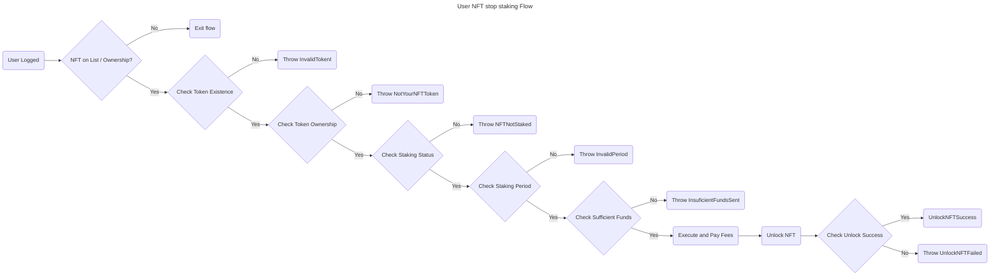

# 2. User NFT Unlock Flow



## Contract

### Errors

The contract throws the following errors:

```solidity
// Custom error types
error InvalidFees(); // thrown when the fees are invalid (less than 0)
error InvalidRewardRate(); // thrown when the reward rate is invalid (less than 0)
error MissingNftAddress(); // thrown when the NFT contract address is not provided
error NFTAddressCannotBeZero(); // thrown when the NFT contract address is the zero address
error InvalidTokenId(); // thrown when the token ID does not exist
error NotYourNFTToken(); // thrown when the token does not belong to the user attempting an action
error InsuficientFundsSent(); // thrown when insufficient funds are sent for fees
error ClaimNotReady(); // thrown when (block.number - (stop + period)) blocks is less than 0
error Unauthorized(); // thrown when has no enough access permissions
error InvalidPeriod(); // thrown when the staking period is not valid enumerate option
error AlreadyStaked(); // thrown when attempting to start staking for a token already staked
error NFTNotStaked(); // thrown when attempting to stop staking for a token not staked by the user
```

### Events

```solidity
// Define events
event LockNFTSuccess(bool success);
event UnlockNFTSuccess(bool success);
event RecoverNFTSuccess(bool success);
event ConsumeRewardsSuccess(bool success);
```

### Structs

```solidity
// Enum for periods
enum Period {
    ONE_DAY,
    SEVEN_DAYS,
    TWENTY_ONE_DAYS
}

// Struct for TokenData
struct TokenData {
    Period period; // Represents the period measured by height units that the NFT gets lock after unlocked where no Rewards are generated during this Period.
    uint256 start; // Starting height use on rewards calculation. Start when the owner stake and transfer ownership.
    uint256 end; // Ending height use on rewards calculation. Once unstake it, no more rewards will be counted.
}

// Struct for UserData
struct UserData {
    uint256 rewards; // Acumulated reward points, only updated when claim successful.
    mapping(uint256 => TokenData) tokens; // User token mapping data
}
```

### Variables

```solidity
// State Variables
address public nft; // Represents the ERC721 address
uint256 public rewardRate; // Represents how many rewards are produced by each height increase while staked
uint256 public fees; // Fees for startStaking(), stopStaking() and recover()
mapping(address => UserData) public users; // users staking and nft data
mapping(address => bool) public whitelist; // list of smart contracts that can interact with user points
```

### Functions

```solidity
/**
 * @dev Constructor function for the contract
 * @param _nftAddress Address of the NFT contract
 * @param _rewardRate Reward rate for staking
 * @param _feeAmount Fee amount for locking NFTs
 */
constructor(address _nftAddress, uint256 _rewardRate, uint256 _feeAmount) public {
  // - Store the owner.
  // - Check `rewardRate` =< 0
  //   - Throw `InvalidRewardRate`.
  // - Set `rewardRate`.
  // - Check `erc721` address == "".
  //   - Throw `MissingNftAddress`
  // - Check `erc721` address == 0.
  //   - Throw `NFTAddressCannotBeZero`
  // - Set `erc721` address.
  // - Check `rewardRate` < 0
  //   - Throw `InvalidFees`.
  // - Set `fees`.
}
```

```solidity
// --- Execute: unlockNFT ---
/**
 * @dev Unlock NFT
 * @param tokenId Token ID to unlock
 */
function unlockNFT(uint256 tokenId) public payable {
    // Check if tokenId exists
    // Check tokenId ownership
    // Check if tokenId is staked
    // Check if funds sent are sufficient
    // Update UserData.end with actual height value
    // Return true
}
```

## User Scenarios

```gherkin
Feature: Unlock NFT
  As a user
  I want to be able to unlock my NFT
  So that I can use it or transfer it to another user

  Scenario: Unlock NFT successfully
    Given I am a user with an NFT that is staked
    And I have sufficient funds to pay the fees
    When I call the unlockNFT function with my NFT's tokenId
    Then the NFT is unlocked
    And the transaction is successful

  Scenario: Unlock NFT that does not exist
    Given I am a user with a non-existent NFT
    When I call the unlockNFT function with the non-existent NFT's tokenId
    Then an error is thrown with the message "InvalidTokenId"

  Scenario: Unlock NFT that I do not own
    Given I am a user with an NFT that is owned by another user
    When I call the unlockNFT function with the NFT's tokenId
    Then an error is thrown with the message "NotYourNFTToken"

  Scenario: Unlock NFT that is not staked
    Given I am a user with an NFT that is not staked
    When I call the unlockNFT function with the NFT's tokenId
    Then an error is thrown with the message "NFTNotStaked"

  Scenario: Unlock NFT without sufficient funds
    Given I am a user with an NFT that is staked
    And I have insufficient funds to pay the fees
    When I call the unlockNFT function with my NFT's tokenId
    Then an error is thrown with the message "InsuficientFundsSent"

  Scenario: Unlock NFT with invalid Time
    Given I am a user with an NFT that is staked
    And the staking period is not valid
    When I call the unlockNFT function with my NFT's tokenId
    Then an error is thrown with the message "NFTPeriodNotReady"
```

### Acceptance Criteria

1. The `unlockNFT` function is able to unlock an NFT that is staked.
2. The `unlockNFT` function throws an error when attempting to unlock an NFT that does not exist.
3. The `unlockNFT` function throws an error when attempting to unlock an NFT that is owned by another user.
4. The `unlockNFT` function throws an error when attempting to unlock an NFT that is not staked.
5. The `unlockNFT` function checks for sufficient funds to pay the fees before unlocking the NFT.
6. The `unlockNFT` function updates the NFT's status to "unlocked" after successful unlocking.
7. The `unlockNFT` function returns a success message after successful unlocking.
8. The `unlockNFT` function throws an error when the fees are invalid.
9. The `unlockNFT` function throws an error when a user attempts to unlock an NFT without sufficient access permissions.
10. The `unlockNFT` function throws an error when the staking period is not valid.

### Test Data Requirements

1. A user with an existing NFT that is staked.
2. A user with a non-existent NFT.
3. A user with an NFT that is owned by another user.
4. A user with an NFT that is not staked.
5. A user with sufficient funds to pay the fees.
6. A user with insufficient funds to pay the fees.
7. An NFT with a valid `tokenId`.
8. An NFT with an invalid `tokenId`.
9. A valid staking period.
10. An invalid staking period.

### Definition of Done (DoD)

1. The `unlockNFT` function has been implemented and tested with the acceptance criteria.
2. The `unlockNFT` function has been reviewed and verified by a peer.
3. The `unlockNFT` function has been deployed to a test environment and tested with the test data requirements.
4. The `unlockNFT` function has been deployed to a production environment.
5. The `unlockNFT` function has been monitored for any errors or issues and updated as necessary.
6. The documentation for the `unlockNFT` function has been updated to reflect any changes or updates.
7. The `unlockNFT` function has been tested for security vulnerabilities and updated as necessary.
8. The `unlockNFT` function has been tested for edge cases and updated as necessary.
9. The `unlockNFT` function has been tested for contract events and updated as necessary.
10. The `unlockNFT` function has been tested for staking period and updated as necessary.
