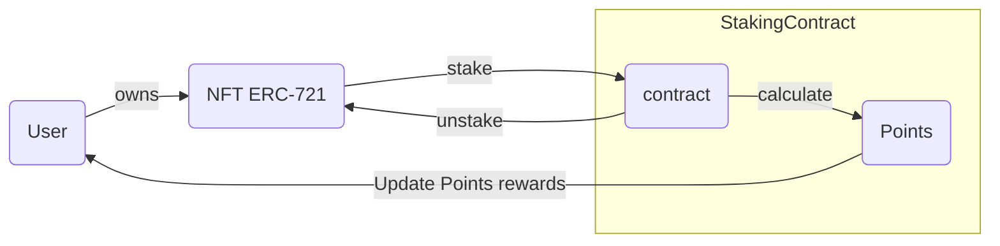
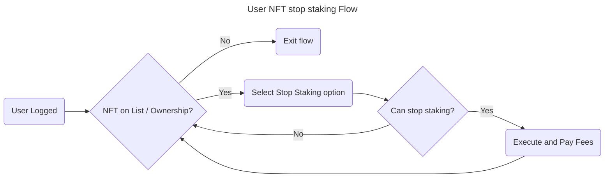

# 4. User NFT Unstaking Flow





## User Scenarios

```gherkin
# Scenario 1: Successful Stop Staking
Scenario: Successful Stop Staking
  Given the user is logged in
  And the user has an NFT on the list and is the owner
  And the user can stop staking
  When the user selects the stop staking option
  And the user executes the stop staking action
  Then the user pays the relevant fees
  And the staking process is stopped for the NFT
  And the user is redirected to the NFT list page

# Scenario 2: NFT Not Found
Scenario: NFT Not Found
  Given the user is logged in
  But the user does not have the NFT on the list or is not the owner
  When the user attempts to select the stop staking option
  Then the user is notified that the NFT is not found or they are not the owner
  And the user is redirected to the NFT list page

# Scenario 3: Stop Staking Not Allowed
Scenario: Stop Staking Not Allowed
  Given the user is logged in
  And the user has an NFT on the list and is the owner
  But the user cannot stop staking
  When the user attempts to select the stop staking option
  Then the user is notified that stopping staking is not allowed
  And the user is redirected to the NFT list page

# Scenario 4: Insufficient Funds
Scenario: Insufficient Funds
  Given the user is logged in
  And the user has an NFT on the list and is the owner
  And the user can stop staking
  But the user has insufficient funds to pay the fees
  When the user attempts to execute the stop staking action
  Then the user is notified that they have insufficient funds
  And the user is redirected to the NFT list page

# Scenario 5: Duplicate Stop Staking Request
Scenario: Duplicate Stop Staking Request
  Given the user is logged in
  And the user has an NFT on the list and is the owner
  And the user has already stopped staking for the NFT
  When the user attempts to execute the stop staking action again
  Then the user is notified that they have already stopped staking
  And the user is redirected to the NFT list page

# Scenario 6: Edge Case - User Not Logged In
Scenario: Edge Case - User Not Logged In
  Given the user is not logged in
  When the user attempts to access the NFT list page
  Then the user is redirected to the login page
```

---

### Acceptance Criteria

- The user can successfully stop staking for an NFT they own and have on the list.
- The user is notified and redirected to the NFT list page if they do not have the NFT on the list or are not the owner.
- The user is notified and redirected to the NFT list page if they cannot stop staking.
- The user is notified and redirected to the NFT list page if they have insufficient funds to pay the fees.
- The user is notified and redirected to the NFT list page if they have already stopped staking for the NFT.
- The user is redirected to the login page if they are not logged in.

### Test Data Requirements

- User credentials (username, password)
- NFT information (ID, name, owner)
- Staking information (status, fees)
- User wallet information (balance, address)

## Definition of Done (DoD)

- The feature is fully implemented and functional.
- All acceptance criteria are met.
- All Gherkin scenarios pass with the required test data.
- The code is reviewed and approved by at least two team members.
- The feature is deployed to the production environment.
- The feature is tested and verified in the production environment.
