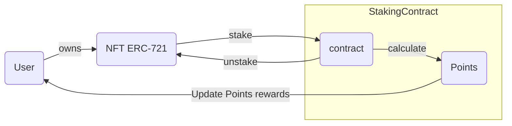
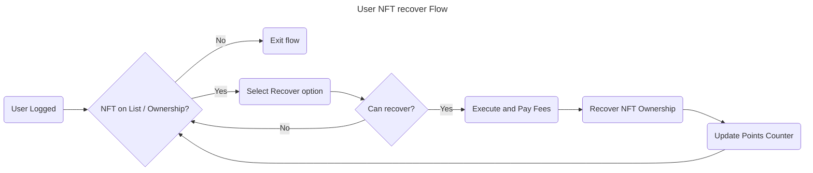

# 3. User NFT Unstaking Flow





## User Scenarios

```gherkin
# Scenario 1: Successful Recover NFT
Scenario: Successful Recover NFT
  Given the user is logged in
  And the user has an NFT on the list and is the owner
  And the user can recover the NFT
  When the user selects the recover option
  And the user executes the recover action
  And the user pays the relevant fees
  Then the NFT ownership is recovered
  And the points counter is updated
  And the user is redirected to the NFT list page

# Scenario 2: NFT Not Found
Scenario: NFT Not Found
  Given the user is logged in
  But the user does not have the NFT on the list or is not the owner
  When the user attempts to select the recover option
  Then the user is notified that the NFT is not found or they are not the owner
  And the user is redirected to the NFT list page

# Scenario 3: Recover Not Allowed
Scenario: Recover Not Allowed
  Given the user is logged in
  And the user has an NFT on the list and is the owner
  But the user cannot recover the NFT
  When the user attempts to select the recover option
  Then the user is notified that recover is not allowed
  And the user is redirected to the NFT list page

# Scenario 4: Insufficient Funds
Scenario: Insufficient Funds
  Given the user is logged in
  And the user has an NFT on the list and is the owner
  And the user can recover the NFT
  But the user has insufficient funds to pay the fees
  When the user attempts to execute the recover action
  Then the user is notified that they have insufficient funds
  And the user is redirected to the NFT list page

# Scenario 5: Points Counter Update Failure
Scenario: Points Counter Update Failure
  Given the user is logged in
  And the user has an NFT on the list and is the owner
  And the user can recover the NFT
  When the user executes the recover action
  And the user pays the relevant fees
  But the points counter update fails
  Then the user is notified that the points counter update failed
  And the NFT ownership is recovered
  But the points counter is not updated
  And the user is redirected to the NFT list page

# Scenario 6: Edge Case - User Not Logged In
Scenario: Edge Case - User Not Logged In
  Given the user is not logged in
  When the user attempts to access the NFT list page
  Then the user is redirected to the login page

# Scenario 7: Edge Case - Recover Already Owned NFT
Scenario: Edge Case - Recover Already Owned NFT
  Given the user is logged in
  And the user has an NFT on the list and is the owner
  When the user attempts to recover the NFT
  Then the user is notified that they already own the NFT
  And the user is redirected to the NFT list page
```

---

### Acceptance Criteria for User NFT claim Flow

- The user can successfully recover NFT ownership.
- The points counter is updated after successful recovery.
- The user is notified and redirected to the NFT list page if the NFT is not found or they are not the owner.
- The user is notified and redirected to the NFT list page if recover is not allowed.
- The user is notified and redirected to the NFT list page if they have insufficient funds to pay the fees.
- The user is notified if the points counter update fails.
- The user is redirected to the login page if they are not logged in.
- The user is notified if they attempt to recover an NFT they already own.

### Test Data Requirements

- User credentials (username, password)
- NFT information (ID, name, owner)
- Points counter information (current points, points to add)
- User wallet information (balance, address)
- Recover fee information (fee amount, fee type)

## Definition of Done (DoD)

- The feature is fully implemented and functional.
- All acceptance criteria are met.
- All Gherkin scenarios pass with the required test data.
- The code is reviewed and approved by at least two team members.
- The feature is deployed to the production environment.
- The feature is tested and verified in the production environment.
- The recover fee calculation is accurate and consistent.
- The points counter update is accurate and consistent.
