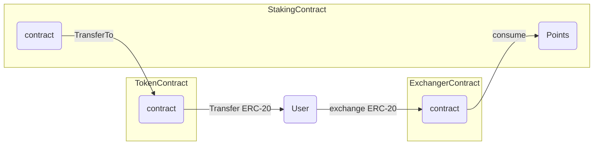
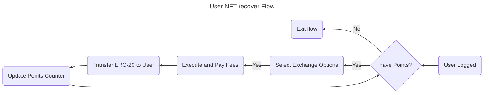

# 4. User Points exchange for ERC-20 Flow





## User Scenarios

```gherkin
# Scenario 1: Successful Recover NFT using Points
Scenario: Successful Recover NFT using Points
  Given the user is logged in
  And the user has points available
  When the user selects the recover NFT option
  And the user selects an exchange option
  And the user executes the recover action
  And the user pays the relevant fees
  Then the ERC-20 token is transferred to the user's wallet
  And the points counter is updated
  And the user is redirected to the points balance page

# Scenario 2: Insufficient Points
Scenario: Insufficient Points
  Given the user is logged in
  But the user does not have sufficient points available
  When the user attempts to select the recover NFT option
  Then the user is notified that they do not have sufficient points
  And the user is redirected to the points balance page

# Scenario 3: Invalid Exchange Option
Scenario: Invalid Exchange Option
  Given the user is logged in
  And the user has points available
  When the user selects the recover NFT option
  And the user selects an invalid exchange option
  Then the user is notified that the exchange option is invalid
  And the user is redirected to the points balance page

# Scenario 4: Execution Failure
Scenario: Execution Failure
  Given the user is logged in
  And the user has points available
  When the user selects the recover NFT option
  And the user selects a valid exchange option
  But the execution of the recover action fails
  Then the user is notified that the execution failed
  And the user is redirected to the points balance page

# Scenario 5: Edge Case - User Not Logged In
Scenario: Edge Case - User Not Logged In
  Given the user is not logged in
  When the user attempts to access the recover NFT option
  Then the user is redirected to the login page

# Scenario 6: Edge Case - No Points Available
Scenario: Edge Case - No Points Available
  Given the user is logged in
  But the user does not have any points available
  When the user attempts to select the recover NFT option
  Then the user is notified that they do not have any points
  And the user is redirected to the points balance page
```

---

### Acceptance Criteria

- The user can successfully recover NFT using points they have available.
- The user is notified and redirected to the points balance page if they do not have sufficient points available.
- The user is notified and redirected to the points balance page if they select an invalid exchange option.
- The user is notified and redirected to the points balance page if the execution of the recover action fails.
- The user is redirected to the login page if they are not logged in.
- The ERC-20 token is transferred to the user's wallet after a successful recover action.
- The points counter is updated correctly after a successful recover action.
- The user is redirected to the points balance page after a successful recover action.

### Test Data Requirements

- User credentials (username, password)
- User points balance information (current points, points to use)
- Exchange options information (e.g. token type, exchange rate)
- User wallet information (balance, address)
- Recover fee information (fee amount, fee type)

## Definition of Done (DoD)

- The feature is fully implemented and functional.
- All acceptance criteria are met.
- All Gherkin scenarios pass with the required test data.
- The code is reviewed and approved by at least two team members.
- The feature is deployed to the production environment.
- The feature is tested and verified in the production environment.
- The ERC-20 token transfer is accurate and consistent.
- The points counter update is accurate and consistent.
- The recover fee calculation is accurate and consistent.
- The user interface is intuitive and user-friendly.
