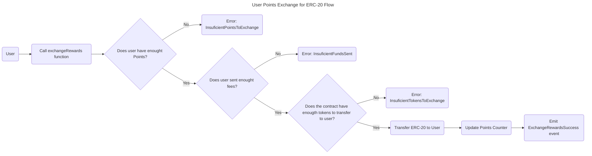

# 4. User Points exchange for ERC-20 Flow



## Contract

### Errors

The contract throws the following errors:

```solidity
// Custom error types
error InsuficientPointsToExchange(); // Throw when the user has no enough points for the operation.
error InsuficientFundsSent(); // Thrown when insufficient funds are sent for fees.
error InsuficientTokensToExchange(); // Throw when the exchange contract has no more ERC20 tokens in its balance.
error StakeAddressCannotBeZero(); // Throw when stake address is zero.
error TokenAddressCannotBeZero(); // Throw when token address is zero.
error InvalidFees(); // Throw when fees are invalid.
```

### Events

```solidity
// Define events
event ExchangeRewardsSuccess();
```

### Variables

```solidity
// State Variables
address public staking; // Represents the Staking address
address public token; // Represents the ERC20 address
uint256 public fees; // Fees for startStaking(), stopStaking() and recover()
```

### Functions

```solidity
/**
 * @dev Constructor function for the contract
 * @param _staking Address of the Staking contract
 * @param _token Address of the ERC20 contract
 * @param _feeAmount Fee amount for locking NFTs
 */
constructor(address _staking, address _token, uint256 _feeAmount) public {
  // - Store the owner.
  // - Check `_staking` address == 0.
  //   - Throw `StakeAddressCannotBeZero`
  // - Set `staking` address.
  // - Check `_token` address == 0.
  //   - Throw `TokenAddressCannotBeZero`
  // - Set `token` address.
  // - Check `fees` < 0
  //   - Throw `InvalidFees`.
  // - Set `fees`.
}
```

```solidity
/**
 * @dev Allows anyone to exchange their rewards points for ERC20 tokens
 * @param _user Address of the user exchanging rewards
 * @param _points Number of points to exchange
 */
function exchangeRewards(address _user, uint256 _points) public {
    // - Check if funds sent are greater or equal than `fees`
    // - Throw error `InsuficientFundsSent`
    // - Check user rewards balance `staking.rewardsBalance(user)` greater or equal to `points`.
    // - Throw error `InsuficientPointsToExchange`
    // - Check `ERC20` contract Balance is greater than `points`
    // - Throw error `InsuficientTokensToExchange`
    // - Call `staking.consumeRewards(user, points)`.
    // - Transfer `ERC20` `points` quantity to `user`
    // Generate event `ExchangeRewardsSuccess`
}
```

## User scenarios

```gherkin
Feature: User Points Exchange for ERC-20
  As a user
  I want to exchange my rewards points for ERC-20 tokens
  So that I can utilize my earned rewards

  Scenario: Successful points exchange for ERC-20 tokens
    Given I have sufficient points for exchange
    And I send enough fees for the transaction
    And the contract has sufficient ERC-20 tokens
    When I call the exchangeRewards function
    Then my points are successfully exchanged for ERC-20 tokens
    And the ExchangeRewardsSuccess event is emitted

  Scenario: Insufficient points for exchange
    Given I do not have enough points for exchange
    When I call the exchangeRewards function
    Then an InsuficientPointsToExchange error is thrown

  Scenario: Insufficient funds sent for fees
    Given I send insufficient funds for fees
    When I call the exchangeRewards function
    Then an InsuficientFundsSent error is thrown

  Scenario: Contract has insufficient ERC-20 tokens
    Given the contract does not have enough ERC-20 tokens for exchange
    When I call the exchangeRewards function
    Then an InsuficientTokensToExchange error is thrown

  Scenario Outline: Edge cases for points exchange
    Given I have <points> points
    And I send <fees_sent> fees
    And the contract has <contract_tokens> ERC-20 tokens
    When I call the exchangeRewards function
    Then the result should be <result>

    Examples:
      | points | fees_sent | contract_tokens | result                                             |
      | 0      | 1          | 100             | InsuficientPointsToExchange error thrown          |
      | 100    | 0          | 100             | InsuficientFundsSent error thrown                 |
      | 100    | 1          | 0               | InsuficientTokensToExchange error thrown          |
      | 100    | 1          | 100             | Exchange successful, ExchangeRewardsSuccess emitted|
```

### **Acceptance Criteria**

* The `exchangeRewards` function successfully exchanges user points for ERC-20 tokens when all conditions are met.
* The function throws `InsuficientPointsToExchange` when the user has insufficient points.
* The function throws `InsuficientFundsSent` when insufficient fees are sent.
* The function throws `InsuficientTokensToExchange` when the contract has insufficient ERC-20 tokens.
* The `ExchangeRewardsSuccess` event is emitted upon successful exchange.

### **Test Data Requirements**

* **User Points**:
  * Sufficient points (e.g., 100)
  * Insufficient points (e.g., 0)
* **Fees Sent**:
  * Sufficient fees (e.g., 1)
  * Insufficient fees (e.g., 0)
* **Contract ERC-20 Tokens**:
  * Sufficient tokens (e.g., 100)
  * Insufficient tokens (e.g., 0)
* **ERC-20 Token**:
  * Valid ERC-20 token address
* **Staking Contract**:
  * Valid staking contract address

### **Definition of Done (DoD)**

* All Gherkin scenarios pass without errors.
* Code coverage for the `exchangeRewards` function and related error handling exceeds 90%.
* A technical review of the implementation has been conducted and approved.
* The `ExchangeRewardsSuccess` event is correctly emitted and can be verified on the blockchain.
* All error scenarios correctly throw their respective errors and are handled gracefully.
